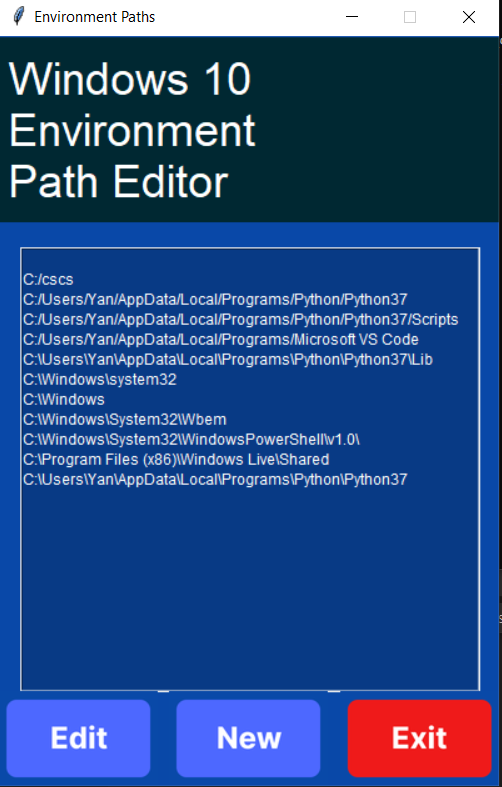
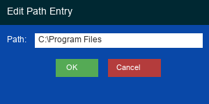

<div align="center">
  

  <h1>Windows10-Env-Manager</h1>

  <p>
    <strong>A user-friendly GUI tool for managing your system's <code>PATH</code>
    environment variable on Windows 10+ &bull; with cross-platform support
    for <strong>macOS</strong> and <strong>Linux</strong>.</strong>
  </p>

  <!-- Badges -->
  <p>
    <a href="https://github.com/abduznik/Windows10-Env-Manager/actions/workflows/ci.yml">
      
    </a>
    <a href="https://github.com/abduznik/Windows10-Env-Manager/blob/main/LICENSE">
      
    </a>
    <a href="https://www.python.org/downloads/">
      
    </a>
    <a href="https://github.com/abduznik/Windows10-Env-Manager/releases">
      
    </a>
    <a href="https://github.com/abduznik/Windows10-Env-Manager/issues">
      
    </a>
  </p>

  <!-- Topics / tags -->
  <p>
    <code>windows</code> &bull; <code>macos</code> &bull; <code>linux</code>
    &bull; <code>path-editor</code> &bull; <code>environment-variables</code>
    &bull; <code>tkinter</code> &bull; <code>python</code>
    &bull; <code>gui</code> &bull; <code>system-administration</code>
  </p>
</div>

---

## Overview

**Windows10-Env-Manager** is a desktop application that makes editing the
system `PATH` variable as easy as clicking a button. Instead of manually
navigating through System Properties or wrestling with PowerShell commands,
you get a clean Tkinter GUI where you can:

- **Browse and select** directories to add to your `PATH`.
- **Edit existing** path entries inline.
- **View all** current `PATH` entries in a scrollable list.
- **Remove or update** individual entries without affecting the rest.

While the primary target is **Windows 10+** (using PowerShell under the
hood), the core library also supports **macOS** and **Linux** by reading
and writing `os.environ` and the user's shell configuration file
(`~/.zshrc`, `~/.bashrc`, etc.).

---

## Features

| Feature | Description |
|---------|-------------|
| 🖥️ **Graphical interface** | Built with Tkinter &mdash; no command-line fiddling |
| 📋 **Scrollable path list** | See all `PATH` entries at a glance |
| ➕ **Add new paths** | Browse folders or type them in |
| ✏️ **Edit existing paths** | Inline editing via a popup dialog |
| 🗑️ **Remove / replace** | Update individual entries or clear the `PATH` |
| 🔄 **Live system update** | Changes take effect immediately on Windows |
| 🐧 **Cross-platform** | Core library works on macOS & Linux too |

---

## Screenshots

| Main window | Path editor popup |
|-------------|-------------------|
|  |  |

---

## Installation

### Option 1 &mdash; Download a release

1. Go to the [Releases page](https://github.com/abduznik/Windows10-Env-Manager/releases).
2. Download the latest `Windows10-Env-Manager-*.exe`.
3. **Run as Administrator** (right-click &rarr; *Run as administrator*).

### Option 2 &mdash; Run from source

```bash
# Clone the repository
git clone https://github.com/abduznik/Windows10-Env-Manager.git
cd Windows10-Env-Manager

# (Optional) Create a virtual environment
python -m venv venv
source venv/bin/activate        # Linux / macOS
venv\Scripts\activate           # Windows

# Install runtime dependencies (tkinter is included with Python)
pip install pyinstaller         # only needed if you want to build an exe

# Launch the application
python main.py
```

> **⚠️ Note:** On Windows you **must** run as Administrator for the
> application to modify system-level environment variables.

---

## Usage

1. **Launch** the application (run as Administrator on Windows).
2. **Select a path** from the scrollable list on the left.
3. Use the three buttons at the bottom:
   - **Edit** (left) &mdash; Opens a popup to modify the selected path.
   - **Add directory** (center) &mdash; Browse for a new folder to add.
   - **Close** (right) &mdash; Exit the application.
4. Changes are written to the system `PATH` immediately.

### Cross-platform notes

| Platform | How PATH is managed |
|----------|-------------------|
| **Windows** | PowerShell commands modify `Machine` / `User` registry scope |
| **macOS** | `os.environ` updated in-session; persisted to `~/.zshrc` |
| **Linux** | `os.environ` updated in-session; persisted to `~/.bashrc` / `~/.profile` |

---

## Development

### Setup

```bash
git clone https://github.com/abduznik/Windows10-Env-Manager.git
cd Windows10-Env-Manager
python -m venv .venv
source .venv/bin/activate        # Linux / macOS
.venv\Scripts\activate           # Windows

pip install ruff pytest          # development tools
```

### Run tests

```bash
pytest -v        # 59+ tests covering all modules
ruff check .     # linting — zero warnings
```

### Project structure

```
Windows10-Env-Manager/
├── main.py                  # Entry point — Tkinter window setup
├── gui_command.py           # GUI actions (add, edit, view paths)
├── cmd_path.py              # Core PATH library (cross-platform)
├── state.py                 # Shared application state
├── utils.py                 # Path helpers
├── conftest.py              # Pytest fixtures & tkinter stubs
├── test_cmd_path.py         # Tests for cmd_path.py
├── test_gui_command.py      # Tests for gui_command.py
├── test_main.py             # Tests for main.py module-level code
├── assets/frame0/           # Button images (button_1.png – button_5.png)
├── build.bat                # PyInstaller build script
├── factory.ps1              # PowerShell helper
└── .github/workflows/
    ├── ci.yml               # Lint + test on every push/PR
    └── release.yml          # Manual release workflow
```

### Linting

We use [ruff](https://docs.astral.sh/ruff/) for fast, zero-config linting:

```bash
ruff check *.py
```

---

## Building an executable

### Using the release workflow (recommended)

1. Go to the **Actions** tab in the GitHub repository.
2. Select the **Release** workflow.
3. Click **Run workflow**, enter a version tag (e.g. `v1.2.3`), and optional notes.
4. The workflow builds the `.exe` and creates a GitHub Release automatically.

### Building locally

```batch
pip install pyinstaller
build.bat
```

The executable will be placed in the `dist/` folder.

---

## Library: `cmd_path.py`

The `cmd_path.py` module is a standalone, cross-platform library for
manipulating the system `PATH` environment variable. It provides:

| Function | Description |
|----------|-------------|
| `check_admin()` | Check for Administrator / root privileges |
| `get_path(scope)` | Retrieve the `PATH` string |
| `set_path(new_path, scope)` | Overwrite the `PATH` |
| `add_to_path(new_path, system_wide)` | Add one or more directories |
| `clear_path(scope)` | Reset `PATH` to empty (use with care!) |
| `save_path_to_file(path_string, file_name)` | Write a copy to disk |

---

## Contributing

Contributions are welcome! Please open an
[issue](https://github.com/abduznik/Windows10-Env-Manager/issues) for bugs
or feature requests, and submit a pull request for any improvements.

---

## License

This project is licensed under the terms of the
[LICENSE](https://github.com/abduznik/Windows10-Env-Manager/blob/main/LICENSE)
file in the repository.
